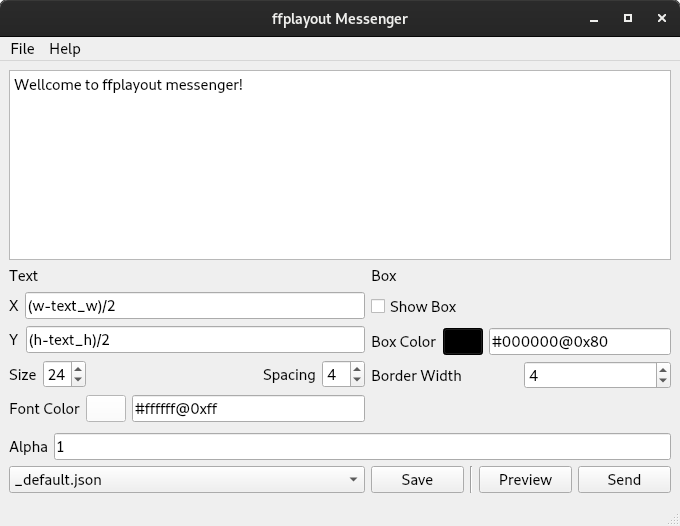

# messenger
ffmpeg can include the libzmq library, this makes it possible to mapiulate filters in real time.

For now, we only comunicate with the drawtext filter in ffplayout. This give us the option to send text to the stream in any format which are supported from the drawtext filter.

The messenger is split in to two programs, one is the [**client application**](./client/messenger.pyw). And the other is the [**API server**](./server/api-server.py)

The **API server** have a simple authentication mechanism which allow only specific user with password to send messages. **It is highly recommended to run this application only behind a proxy with ssl - for example nginx.**

### Expression:
**drawtext** can be controlled with different expressions for fading, or moving, the client will have some examples, for more take a look in the [filter settings](https://ffmpeg.org/ffmpeg-filters.html#drawtext-1) and in the [expression parameters](https://ffmpeg.org/ffmpeg-all.html#Expression-Evaluation).

Please don't ask in the issues about help for different kind of expressions. This is only a GUI for the ffmpeg settings. A better place for this kind of help is [stackoverflow](https://stackoverflow.com/).

If you have some nice and usefull expressions you are wellcome to share them with us. I'm happy to integrate them in the GUI as a preset or example.

### Testing/Preview
When you add new expressions to the client, you should always test them, before you send them to ffplayout. A wrong command can crash the playout.

### Configuration
The **client** can be configure with [messenger.ini](./client/assets/messenger.ini)

The **API server** has no config file, you can setup everthing in the script. When there is a need, we can change this later.
